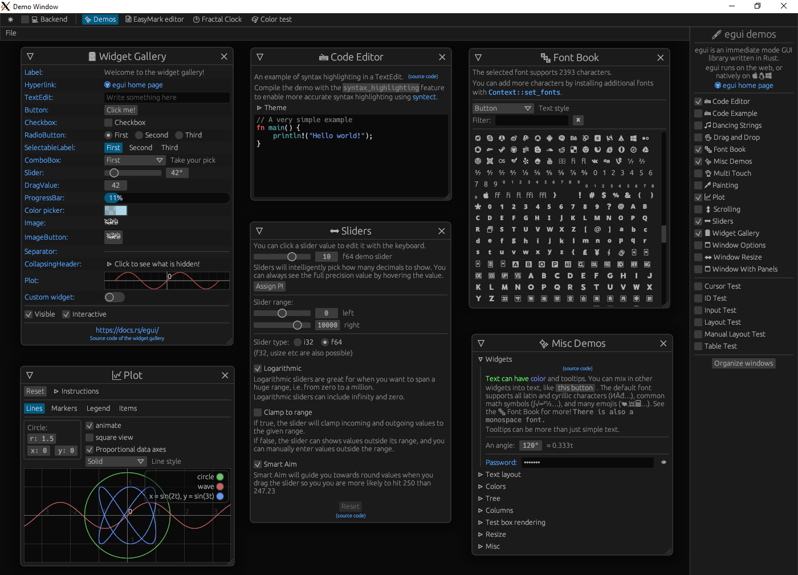

# Egui FLTK Frontend

[](https://crates.io/crates/egui-fltk-frontend)
[](https://docs.rs/egui-fltk-frontend)
[](https://github.com/Ar37-rs/egui-fltk-frontend/actions/workflows/ci.yml)

[FLTK](https://github.com/fltk-rs/fltk-rs) Frontend for [Egui WGPU Backend](https://github.com/hasenbanck/egui_wgpu_backend)

## On linux Debian/Ubuntu based distros, install latest build tools (if not installed)

```
sudo apt-get update && sudo apt-get install build-essential cmake ninja-build
```

make sure to install the latest FLTK requirements:
```
sudo apt-get update && sudo apt-get install -y libpango1.0-dev libx11-dev libxext-dev libxft-dev libxinerama-dev libxcursor-dev libxrender-dev libxfixes-dev libgl1-mesa-dev libglu1-mesa-dev libmpv-dev
```

and egui requirements as well:
```
sudo apt-get install libxcb-render0-dev libxcb-shape0-dev libxcb-xfixes0-dev libspeechd-dev libxkbcommon-dev libssl-dev
```

## Usage

On wayland desktop disable default-features:
```toml
[dependencies]
egui-fltk-frontend = { version = "0.17", default-features = false,  features = ["wayland"] }
```

## Example

Running example *.rs files:

```
cargo run --example main
cargo run --example image
```

or [click here](https://github.com/Ar37-rs/egui-fltk-frontend/tree/main/examples) on how to use it inside Cargo.toml

## Screenshot
[main_example](https://github.com/Ar37-rs/egui-fltk-frontend/tree/main/examples/main_example) running on WSL2 + X Server:

